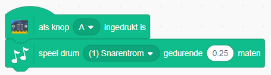
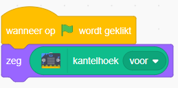
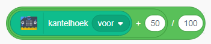
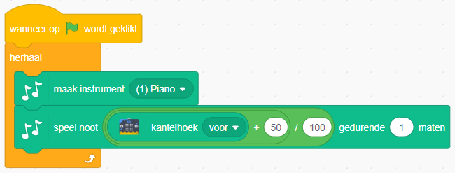
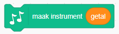
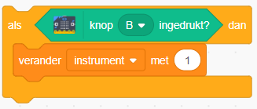

# CoderDojo #53 - 1 juni 2019

## Sonic Pi

Zorg dat je het programma hebt geïnstalleerd: <https://sonic-pi.net/>

- <https://coderdojo-leiden.nl/sonic-pi>
- <https://coderdojo-nijmegen.nl/wp-content/uploads/2015/04/LES-1-Sonic-Pi-Je-eerste-geluiden-met-Sonic-Pi.pdf>

## Scratch

Ga naar <https://scratch.mit.edu/>

- Als je nog niet eerder met Scratch hebt gewerkt is dit een mooie start: <https://projects.raspberrypi.org/nl-NL/projects/cd-beginner-scratch-sushi>
- Hier vind je een project over muziek (de code is nog van Scratch 2, vraag vooral hulp als dit verwarring geeft): <https://projects.raspberrypi.org/nl-NL/projects/rock-band>

## micro:bit

Voor dit programma gebruiken we de micro:bit uitbreiding van Scratch. **Let op: dit kan op dit moment alleen als je een computer hebt met Windows 10 of Mac OS 10+ en met Bluetooth 4.0.**
Doel van het programma is om muziek te maken met de micro:bit als besturing.

<ol>
  <li>
    Volg <a href="https://scratch.mit.edu/microbit">deze instructies</a> om de micro:bit in Scratch te kunnen gebruiken.
  </li>
  <li>
    Klik linksonder op het Scratch Extensions icoon en voeg de Muziek en micro:bit extensies toe. Bij het toevoegen van de micro:bit extensie probeert Scratch ook meteen verbinding met de micro:bit te maken. Het is <i>niet</i> nodig de micro:bit via de USB kabel te verbinden; wel moet je dan de batterijen aansluiten.
  </li>
  <li>
    Maak om te kijken of de verbinding werkt het volgende programmaatje:
  </li>
  

    
micro:bit code

        
  

  <li>
    Het is nu tijd om de <i>kanteling</i> van de micro:bit te gaan gebruiken in de besturing van de muziek, bijvoorbeeld voor hoe hoog en hoe lang een toon klinkt. Eerst gaan we de Scratch kat laten vertellen wat de <i>hoek</i> van de micro:bit is. Je kunt zowel de kanteling van links naar rechts als die van voor naar achter bekijken:
  </li>
  

    
micro:bit code

        
  

  <li>
    Je kunt deze hoek niet meteen als hoogte of lengte gebruiken, deze waarde moet eerst "vertaald" worden. Kijk eens naar de laagste en hoogste waarde die de hoeken kunnen maken, en wat de laagste/hoogste en kortste/langste noot is die je in je muziek wilt gebruiken. Een voorbeeld: als je de waarden van -50 naar +50 wilt vertalen naar 0 tot 1, dan krijg je als formule:
  </li>
  

    
micro:bit code

        
  

    Vraag gerust om hulp als je hier niet uitkomt, dit zijn lastige puzzels!
  <li>
    Je programma zou er (voor één van de hoeken) nu ongeveer zou uit moeten zien. Gebruik de "herhaal" loop om de noot steeds weer opnieuw te laten spelen. Breid dit uit met de andere hoek.
  </li>
  

    
micro:bit code

        
  

  <li>
    De volgende stap is om van instrument te wisselen door op de knoppen van de micro:bit te drukken. Je kunt bij het <i>maak instrument</i> blok een instrument kiezen door uit de lijst te kiezen, maar ook door een getal in het blok te stoppen:
  </li>
  

    
micro:bit code

        
  

  Het <i>getal</i> blok in de afbeelding is een <i>variabele</i>. Maak nu eerst een variabele aan om het instrument te bepalen.
  <li>
    Nu wil je dat de variabele een nieuwe waarde krijgt als je op een knop van de micro:bit drukt. Daarvoor gebruik je het *als-dan* blok:
  </li>
  

    
micro:bit code

        
    Doe dit ook voor de andere knop.
  

  <li>
    Extra uitdaging: er zijn 21 instrumenten in Scratch. Wat gebeurt er als je variabele waarde 22 heeft? Om te voorkomen dat Scratch een niet-bestaand instrument moet spelen kun je bijvoorbeeld de waarde van je variabele niet hoger laten worden dan 21, of deze weer naar 1 laten gaan als je bij 21 bent geweest.
  </li>
